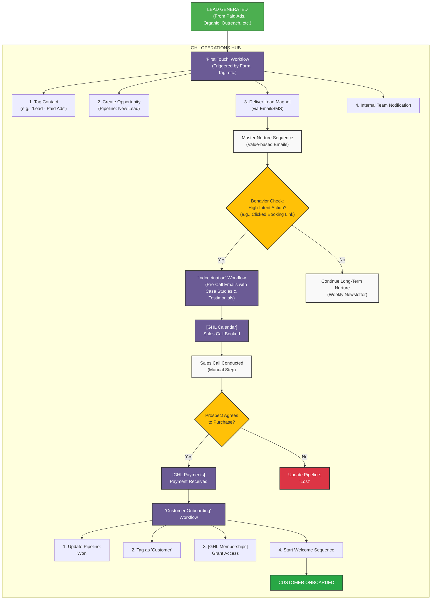

# GHL-Operations-Blueprint

```mermaid
graph TD
    %% Define Styles for different node types
    classDef entry fill:#4CAF50,color:white,stroke:#333,stroke-width:2px;
    classDef ghl fill:#6b5b95,color:white,stroke:#333,stroke-width:2px;
    classDef process fill:#f9f9f9,stroke:#333,stroke-width:2px;
    classDef decision fill:#ffc107,color:#333,stroke:#333,stroke-width:2px;
    classDef final fill:#28a745,color:white,stroke:#333,stroke-width:2px;
    classDef lost fill:#dc3545,color:white,stroke:#333,stroke-width:2px;

    %% STAGE 1: Lead Entry
    A["LEAD GENERATED
    (From Paid Ads, Organic, Outreach, etc.)"]:::entry;

    %% STAGE 2: GHL Operations Hub
    subgraph GHL OPERATIONS HUB
        direction LR
        
        %% 2a: First Touch Automation
        B["'First Touch' Workflow
        (Triggered by Form, Tag, etc.)"]:::ghl;
        B --> B1["1. Tag Contact
        (e.g., 'Lead - Paid Ads')"];
        B --> B2["2. Create Opportunity
        (Pipeline: New Lead)"];
        B --> B3["3. Deliver Lead Magnet
        (via Email/SMS)"];
        B --> B4["4. Internal Team Notification"];

        %% 2b: Nurture & Qualification
        C["Master Nurture Sequence
        (Value-based Emails)"]:::process;
        D{"Behavior Check:
        High-Intent Action?
        (e.g., Clicked Booking Link)"}:::decision;
        E["'Indoctrination' Workflow
        (Pre-Call Emails with Case Studies & Testimonials)"]:::ghl;
        F["Continue Long-Term Nurture
        (Weekly Newsletter)"]:::process;

        %% 2c: Sales Pipeline & Conversion
        G["[GHL Calendar]
        Sales Call Booked"]:::ghl;
        H["Sales Call Conducted
        (Manual Step)"]:::process;
        I{"Prospect Agrees
        to Purchase?"}:::decision;
        J["[GHL Payments]
        Payment Received"]:::ghl;
        K["Update Pipeline:
        'Lost'"]:::lost;
        
        %% 2d: Onboarding
        L["'Customer Onboarding' Workflow"]:::ghl;
        L --> L1["1. Update Pipeline:
        'Won'"];
        L --> L2["2. Tag as 'Customer'"];
        L --> L3["3. [GHL Memberships]
        Grant Access"];
        L --> L4["4. Start Welcome Sequence"];
        M["CUSTOMER ONBOARDED"]:::final;

    end

    %% Define the flow connections
    A --> B;
    B3 --> C;
    C --> D;
    D -- Yes --> E;
    D -- No --> F;
    E --> G;
    G --> H;
    H --> I;
    I -- Yes --> J;
    I -- No --> K;
    J --> L;
    L4 --> M;
```
